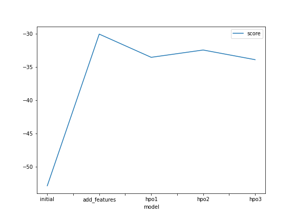
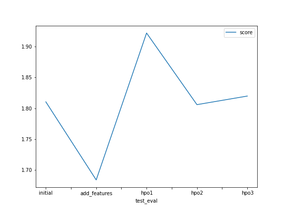

# Report: Predict Bike Sharing Demand with AutoGluon Solution
#### Ashley Perez

## Initial Training
### What did you realize when you tried to submit your predictions? What changes were needed to the output of the predictor to submit your results?
After submitting the initial predictions specified to predict Bike Sharing Demand, there was realization that the top model scored relatively low compared to other submissions in Kaggle. Also, in the notebook, there was suggestion that some prediction entries may have been less than zero values, which was unexpected. Zeros had to be put in place for negative values submitted by the model in order to be able to submit for some of the models.

### What was the top ranked model that performed?
The top model submitted was the second model completed for the project, also known as the 'add_features' model. This model kept the default parameters for Autogluon and I used the datetime function to create hours as a new feature in the dataset.

## Exploratory data analysis and feature creation
### What did the exploratory analysis find and how did you add additional features?
During exploratory data analysis, understanding which features could be categorical was recognized and the improvement in the results for creating a new feature for hours influenced further feature engineering for the project. Following the intial hour feature created, I also created a feature for day and month to see if this would also improve the model results. 

### How much better did your model preform after adding additional features and why do you think that is?
For initial hyperparameter optimization, only high-level parameters were changed to compare to the original parameters specified. Compared to this high-level change, adding a feature for months for the second hyperparameter optimization, the model improved significantly, from -33.5 to -32.5 score. This was not necessarily the case for the feature added for days, the score decreased from -32.5 to -33.9. There is likely correlation between season and month features whereas there is less correlation for days with the other features available for training. 

## Hyper parameter tuning
### How much better did your model preform after trying different hyper parameters?
My models did not perform better than the 'add_features' model completed in the exploratory analysis phase. 
The approach taken for hyperparameter tuning was related to taking the top models and concentrating on the top models from the baseline autogluon runs from exploratory data analysis section in subsequent trials. Additionally, adding more training time, and specifying some of the hyperparameter tuning metrics was attempted. This was done concurrently with some feature engineering with the datetime for months and days. The hyperparameter tuned runs were behind 2 to 4 points the highest scoring model and seemed to improve and not improve with some of the changes made in tuning.

### If you were given more time with this dataset, where do you think you would spend more time?
Considering the efforts and time spent working on the project, feature engineering was more interpretable for me to be able to make changes that had significant impact on the end results. Changing the hyperparameters for autogluon was more tedious, required more reading of documentation, and uncertainty about the improvement of the results. With more experience with the tool, I think changing hyperparameters may eventually be less time-intensive. If given more time with the dataset, I would likely spend more time on feature engineering categories for weather and studying correlations of the categories, instead of time, more.

### Create a table with the models you ran, the hyperparameters modified, and the kaggle score.
|model|hpo1|hpo2|hpo3|score|
|Bike Sharing Demand|time_limit|stable model options|presets|kaggle|
|initial|600|default|best_quality|1.81050|
|add_features|600|default|best_quality|1.68409|
|hpo|600|Exclude: NN, FASTAI, LR|best_quality|1.80593|

It should be noted that I am submitting the highest scoring hpo score from the hyperparameter tuning section. I completed three different settings: hpo1, hpo2, and hpo3. This submission is for hpo2 as 'hpo'. I varied the time limit, the amount of models trained, the presets. For presets, I did not end up submitting the score for hpo1 as the results came out mostly '-' and did not use the time limit permitted for the training. By mistake, I thought since the run did not use the time limit, there was an error and re-ran the model with 'best_quality' presets. I compared the results and decided to use this for the remaining trainings.
### Create a line plot showing the top model score for the three (or more) training runs during the project.

### Create a line plot showing the top kaggle score for the three (or more) prediction submissions during the project.

## Summary
For the Bike Sharing Demand project on Kaggle, using Autogluon as an AutoML tool was experienced and experimented with, applying concepts such as exploratory data analysis and feature engineering to improve the results over time. With guidance, initializing the tool and exploring the data helped improve initial scores using feature engineering for datetime. Further, exploring hyperparameter tuning was encouraged and new territory. Hyperparameter documentation played a significant role in supplmenting self-learning in order to better understand the parameter options for Autogluon. Reflecting on the results of the project, there was more emphasis on time features and I now realize that correlation matrices and feature importance functions may be useful in guiding where time should be spent for feature engineering: weather features. Hyperparameter tuning did not always improve the results of the model and that a better understanding of the parameters may improve with time and experience, however, features seem to have a more significant impact on the results. Overall, this Bike Sharing Demand project helped me get hands-on experience with the AutoGluon AutoML tool and experiment with hyperparameters and witness the significance of feature engineering on model results. 
